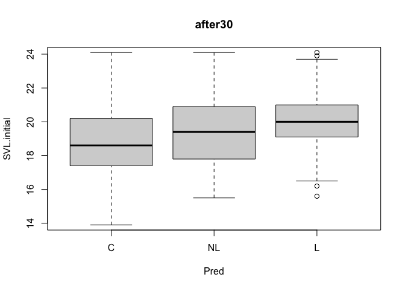
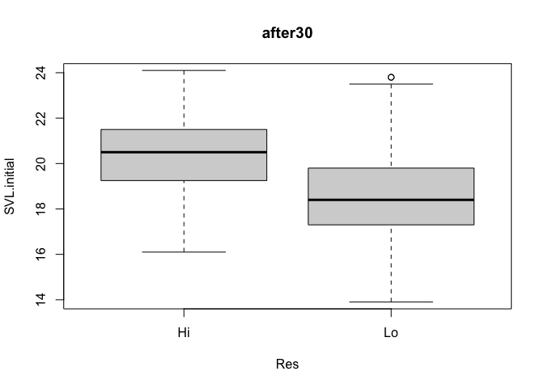

Chapter 3 answers
================
Justin Touchon
7/21/2021

This page provides sample answers to the assignment at the end of
Chapter 3 of Applied Statistics with R: A Practical Guide for the Life
Sciences by Justin Touchon. Chapter 3 focuses on *Exploratory Data
Analysis* which is about the first thing you should do when you read
your data into R. You should ***look*** at it! Plot it in various ways
and look for patterns, either real patterns in the data that might cause
you to ask questions or patterns that seem fishy and might make you
wonder what is going on.

In Chapter 3, you learned a lot of basic things like plotting you data
using base graphics, subsetting your data using square brackets and
logical statements, and aggregating the data to calculate group means
and standard deviations. You also started using the ***dplyr*** package
to do some basic data wrangling, such as using the function **filter()**
and the **%&gt;%** command.

There are two simple assignments to do to continue working on the skills
you are building. As always, my hope is that you are here either because
1) you want to check the answers you got to make sure you completed the
assignments correctly, or 2) you got stumped and need some help. Either
way, you will learn much more if you have already spent some time
working through the assignments on your own. If you haven’t done that,
close this page and go work on it! :)

<span style="color: #009933;">

# Assignment 1

**Use** filter() **to subset the data to just those froglets that
emerged during or after the first 30 days of the period of
metamorphosis.**

</span>

How should you go about doing this? As with anything in R, there are of
course many different ways. You could use square brackets, but since the
assignment specifically states to use the filter function, let’s do
that. Both techniques would require you to use logical statements.
Essentially, what we want to do is create two new data frames, one that
includes the individuals that metamorphosed up to 30 days into the
period of metamorphosis (i.e. using the Age.FromEmergence variable), and
those that emerged at 31 days or later. First, let’s make sure we the
necessary packages loaded.

``` r
library(tidyverse)
```

Next, read in the data and make sure the data are cleaned up. I’m just
going to load the RxP.clean data directly into R, but you should have
this version of the data, if you’ve completed Chapter 3 already (which
of course you should have, right?).

``` r
RxP.clean<-read.csv("RxP_clean.csv", stringsAsFactors = T)
```

As always, let’s look at the structure to make sure everything looks
good.

``` r
str(RxP.clean)
```

    ## 'data.frame':    2493 obs. of  14 variables:
    ##  $ Ind              : int  1 2 3 4 5 6 7 8 9 10 ...
    ##  $ Block            : int  5 5 5 5 5 5 5 2 2 1 ...
    ##  $ Tank             : int  7 4 4 7 10 4 4 5 4 1 ...
    ##  $ Tank.Unique      : int  55 52 52 55 58 52 52 17 16 1 ...
    ##  $ Hatch            : Factor w/ 2 levels "E","L": 1 2 2 1 2 2 2 1 2 2 ...
    ##  $ Pred             : Factor w/ 3 levels "C","L","NL": 3 1 1 3 2 1 1 2 1 3 ...
    ##  $ Res              : Factor w/ 2 levels "Hi","Lo": 1 1 1 1 1 1 1 1 1 1 ...
    ##  $ Age.DPO          : int  35 35 35 35 36 36 36 39 39 39 ...
    ##  $ Age.FromEmergence: int  1 1 1 1 2 2 2 5 5 5 ...
    ##  $ SVL.initial      : num  18 17.7 18.1 16.8 18.7 17.5 17.3 19.6 16.5 17.5 ...
    ##  $ Tail.initial     : num  5.4 1.1 5 6.4 6.3 4.4 1.3 1.5 2 5.1 ...
    ##  $ SVL.final        : num  17 18 17.8 17.1 19.3 17.8 17.9 19.6 17.7 19.5 ...
    ##  $ Mass.final       : num  0.38 0.35 0.41 0.3 0.46 0.3 0.42 0.5 0.33 0.46 ...
    ##  $ Resorb.days      : int  3 3 3 3 3 4 2 2 2 3 ...

If you look closely, you will notice that the *Pred* factor is not in
the same order as what you created in Chapter 3. That is because when I
read the file in on my computer, R just treats the levels of the factor
in alphabetical order. I’ll put them back in the right order really
quick.

``` r
RxP.clean$Pred<-factor(RxP.clean$Pred, levels=c("C","NL","L"))
str(RxP.clean)
```

    ## 'data.frame':    2493 obs. of  14 variables:
    ##  $ Ind              : int  1 2 3 4 5 6 7 8 9 10 ...
    ##  $ Block            : int  5 5 5 5 5 5 5 2 2 1 ...
    ##  $ Tank             : int  7 4 4 7 10 4 4 5 4 1 ...
    ##  $ Tank.Unique      : int  55 52 52 55 58 52 52 17 16 1 ...
    ##  $ Hatch            : Factor w/ 2 levels "E","L": 1 2 2 1 2 2 2 1 2 2 ...
    ##  $ Pred             : Factor w/ 3 levels "C","NL","L": 2 1 1 2 3 1 1 3 1 2 ...
    ##  $ Res              : Factor w/ 2 levels "Hi","Lo": 1 1 1 1 1 1 1 1 1 1 ...
    ##  $ Age.DPO          : int  35 35 35 35 36 36 36 39 39 39 ...
    ##  $ Age.FromEmergence: int  1 1 1 1 2 2 2 5 5 5 ...
    ##  $ SVL.initial      : num  18 17.7 18.1 16.8 18.7 17.5 17.3 19.6 16.5 17.5 ...
    ##  $ Tail.initial     : num  5.4 1.1 5 6.4 6.3 4.4 1.3 1.5 2 5.1 ...
    ##  $ SVL.final        : num  17 18 17.8 17.1 19.3 17.8 17.9 19.6 17.7 19.5 ...
    ##  $ Mass.final       : num  0.38 0.35 0.41 0.3 0.46 0.3 0.42 0.5 0.33 0.46 ...
    ##  $ Resorb.days      : int  3 3 3 3 3 4 2 2 2 3 ...

Okay, now we are ready. I’m going to create two new data frames, one
called *before30* and another called *after30*. I realized that “before
30” is not technically correct, since the data will include animals that
metamorphosed on day 30, but *before30* seemed like a better name than
*before\_and\_including30*.

``` r
before30<-RxP.clean %>% filter(Age.FromEmergence <= 30)
after30<-RxP.clean %>% filter(Age.FromEmergence > 30) 
```

If we look at the head of each data frame, it will reveal some obvious
differences and show us that our code worked. We can also look at the
number of rows in each data frame to see how long they are.

``` r
nrow(before30)
```

    ## [1] 1448

``` r
nrow(after30)
```

    ## [1] 1045

``` r
head(before30)
```

    ##   Ind Block Tank Tank.Unique Hatch Pred Res Age.DPO Age.FromEmergence
    ## 1   1     5    7          55     E   NL  Hi      35                 1
    ## 2   2     5    4          52     L    C  Hi      35                 1
    ## 3   3     5    4          52     L    C  Hi      35                 1
    ## 4   4     5    7          55     E   NL  Hi      35                 1
    ## 5   5     5   10          58     L    L  Hi      36                 2
    ## 6   6     5    4          52     L    C  Hi      36                 2
    ##   SVL.initial Tail.initial SVL.final Mass.final Resorb.days
    ## 1        18.0          5.4      17.0       0.38           3
    ## 2        17.7          1.1      18.0       0.35           3
    ## 3        18.1          5.0      17.8       0.41           3
    ## 4        16.8          6.4      17.1       0.30           3
    ## 5        18.7          6.3      19.3       0.46           3
    ## 6        17.5          4.4      17.8       0.30           4

``` r
head(after30)
```

    ##    Ind Block Tank Tank.Unique Hatch Pred Res Age.DPO Age.FromEmergence
    ## 1 1408     1   11          11     E   NL  Lo      65                31
    ## 2 1409     1    7           7     L   NL  Lo      65                31
    ## 3 1410     2    7          19     E   NL  Hi      65                31
    ## 4 1412     1    4           4     L    L  Lo      65                31
    ## 5 1413     1   11          11     E   NL  Lo      65                31
    ## 6 1414     1   10          10     L    C  Lo      65                31
    ##   SVL.initial Tail.initial SVL.final Mass.final Resorb.days
    ## 1        20.4          6.2      19.6       0.45           3
    ## 2        17.2          7.5      18.2       0.32           4
    ## 3        18.8          7.6      20.3       0.49           6
    ## 4        19.1          6.7      19.7       0.41           3
    ## 5        18.0          7.8      18.5       0.38           4
    ## 6        16.6          0.6      17.1       0.28           2

We can see that there were 1448 animals that metamorphosed up to 30
days, and 1045 animals that metamorphosed after 30 days. Those numbers
add up to 2493, the number of rows in *RxP.clean*, so it certainly looks
like we have successfully divvied up our data. Yay! There are of course
other ways we could do this. For example, we could use an “if else”
statement to create a new categorical variable to indicate if a given
froglet metamorphosed on or before day 30 versus after day 30. You could
do something like this if you wanted. Note that the function
**ifelse()** contains three arguments. 1) First define some logical
statement that will return a True or False answer, 2) define what you
want to have happen when the answer is TRUE, and 3) define what should
happen when the answer is FALSE. Below, I have defined a new variable
*RxP.clean$before30* which will be filled with lots of Yeses and Noes.

``` r
RxP.clean$before30<-ifelse(RxP.clean$Age.FromEmergence<=30,"Yes","No")
```

<span style="color: #009933;">

# Assignment 2

**Next, create box-and-whisker plots of SVL.initial or Mass.final for
each group. What does this reveal about animals that emerged earlier or
later in the window of metamorphosis?**

</span>

This is really easy to do. You’ve already seen how to make
box-and-whisker plots in Chapter 3, so now we are going to do that with
our new subsetted data frames. I’m going to start by plotting
differences in SVL for the three preator treatments. Notice that I’ve
set the *ylim=* argument so that the two figures have the same y-axis
values, which makes them easier to compare visually.

``` r
plot(SVL.initial~Pred, data=before30, ylim=c(14,24), main="before30")
```

<!-- -->

``` r
plot(SVL.initial~Pred, data=after30, ylim=c(14,24), main="after30")
```

<!-- -->

Looking at those figures is fairly informative. While the metamorphs
that emerged later are larger, there appears to be less of a difference
between the three groups.

Okay, now let’s explore the effects of Resource treatment.

``` r
plot(SVL.initial~Res, data=before30, ylim=c(14,24), main="before30")
```

<!-- -->

``` r
plot(SVL.initial~Res, data=after30, ylim=c(14,24), main="after30")
```

<!-- -->

This is also very interesting. Here, the effect of resources appears to
be more dramatic later on. The animals that emerged before 30 days have
less of a difference between them than the animals emerging later on.
